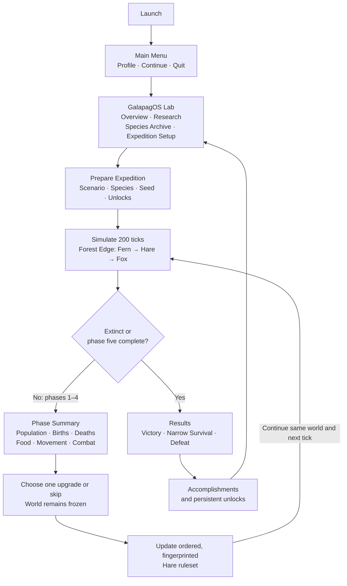
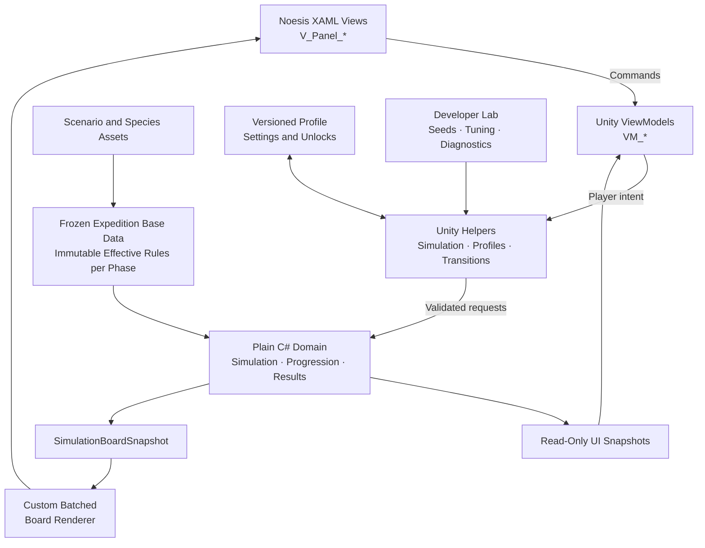
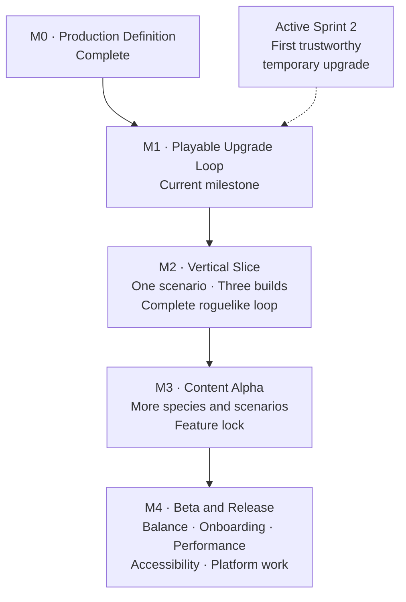

# Game architecture and flows

> Status: Living reference  
> Last reviewed: 2026-09-04
> Scope: Player loop, runtime boundaries, and production progression

This document compresses the current game structure into three complementary
views. It introduces no new design decision. Product and implementation details
remain authoritative in the linked source documents.

## 1. Player and run loop



The vertical-slice contract is five 200-tick phases, four upgrade decisions,
and an immediate end after a completed tick causes extinction. The player
changes the species rules rather than directly commanding individual cells.

This is the target player loop. The current preview still reinitializes between
windows; its replacement is [planned](../CONTINUOUS_SIMULATION_FLOW_PLAN.md).
Phases retain creatures, resources, time and history. Only a new expedition or
explicit restart creates a new board. The current 20-second prototype phase and
the product's longer viewing-time target are separate pacing settings.

## 2. Runtime architecture



The dependency direction is:

```text
View → ViewModel → Helper → Domain
```

The domain does not depend on Noesis, XAML, or player-facing UI state. The live
board uses a dedicated renderer backed by an immutable snapshot instead of one
XAML control per cell.

## 3. Production roadmap



The current production question is deliberately small: can a player choose an
upgrade, observe it changing the ecosystem, and understand why the run changed?

## Authoritative sources

- [Project context](../PROJECT_CONTEXT.md)
- [Vertical-slice product brief](../PRODUCT_BRIEF.md)
- [Production roadmap](../../ROADMAP.md)
- [Main Menu and Lab delivery plan](../MAIN_MENU_LAB_DELIVERY_PLAN.md)
- [Unity MVVM architecture plan](../UNITY_MVVM_ARCHITECTURE_PLAN.md)
- [Upgrade-system direction](../UPGRADE_SYSTEM_DIRECTION.md)
- [Current work-bucket plan](../NEXT_WORK_BUCKET_PLAN.md)
