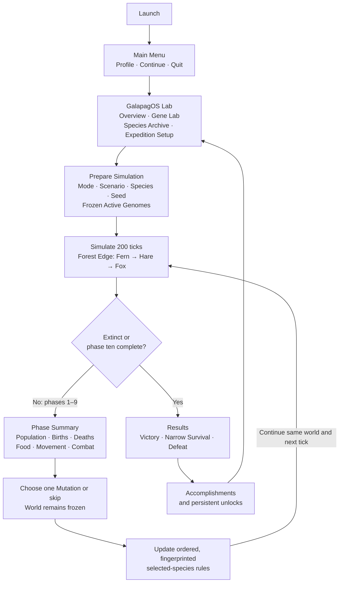
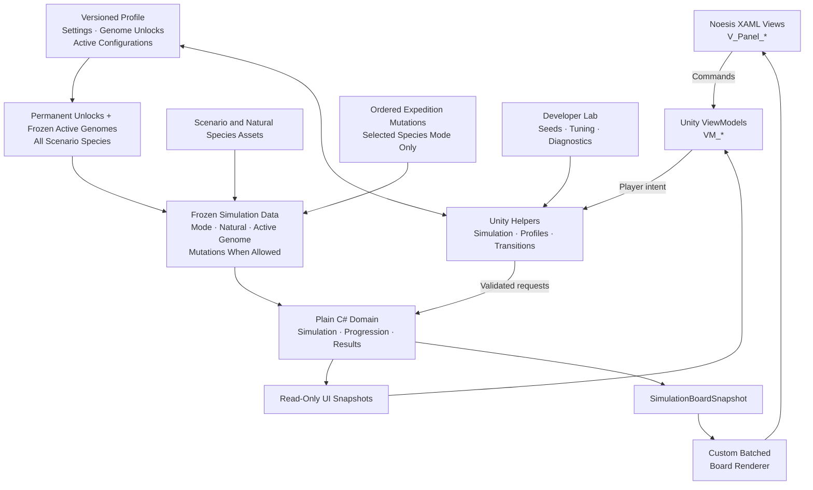
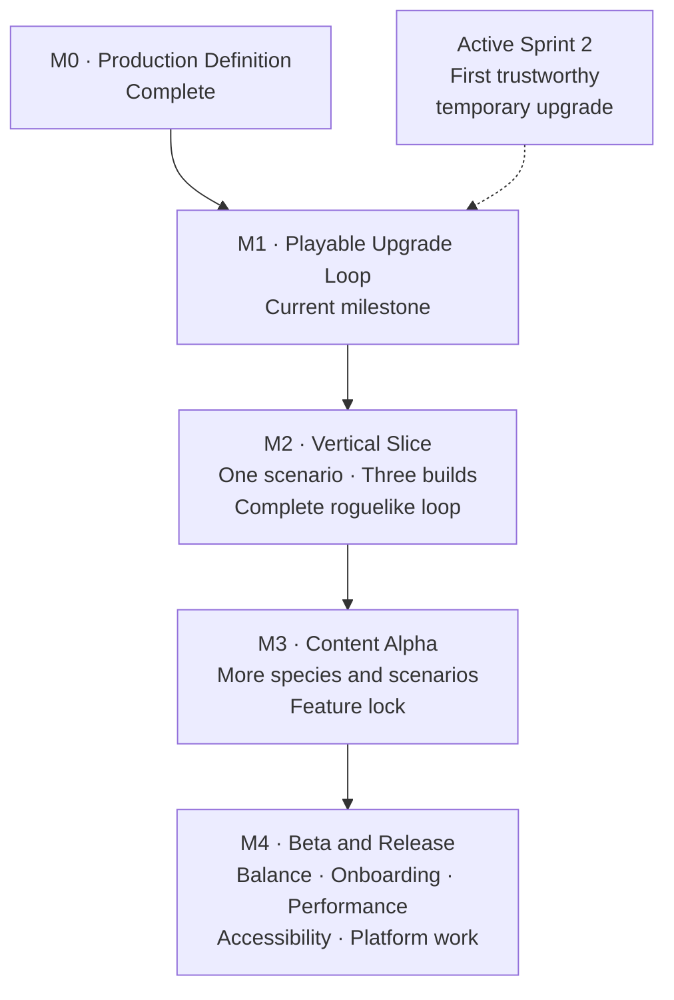

# Game architecture and flows

> Status: Living reference  
> Last reviewed: 2026-09-06
> Scope: Player loop, runtime boundaries, and production progression

This document compresses the current game structure into three complementary
views. It introduces no new design decision. Product and implementation details
remain authoritative in the linked source documents.

## 1. Player and run loop



The vertical-slice contract is ten phases, with 200 ticks as the current
per-phase target, and nine Mutation decision points,
and an immediate end after a completed tick causes extinction. The player
changes the species rules rather than directly commanding individual cells.

Between simulations, the player can permanently unlock Genome options and
change which unlocked nodes are active. Each participating species receives
its frozen active Genome even when it is not the player-controlled species.
Mutations exist only in Species Simulations; Biome Simulations use active
Genomes without Mutation choices.

This is the target player loop. The controlled preview now retains creatures,
resources, time and history through its phase decisions. Only a new expedition
or explicit restart creates a new board. The configurable prototype phase and
the product's longer viewing-time target are separate pacing settings.

## 2. Runtime architecture



The dependency direction is:

```text
View → ViewModel → Helper → Domain
```

The domain does not depend on Noesis, XAML, or player-facing UI state. The live
board uses a dedicated renderer backed by an immutable snapshot instead of one
XAML control per cell.

## 3. Production roadmap



The current production question is deliberately small: can a player choose a
Mutation, observe it changing the ecosystem, and understand why the Species
Simulation changed? The next progression question is whether a permanent Genome
unlock can be activated or deactivated between simulations, is applied to its
species in both player and background roles when active, and produces readable
focal and Biome consequences.

## Authoritative sources

- [Project context](../PROJECT_CONTEXT.md)
- [Vertical-slice product brief](../PRODUCT_BRIEF.md)
- [Production roadmap](../../ROADMAP.md)
- [Main Menu and Lab delivery plan](../MAIN_MENU_LAB_DELIVERY_PLAN.md)
- [Unity MVVM architecture plan](../UNITY_MVVM_ARCHITECTURE_PLAN.md)
- [Upgrade-system direction](../UPGRADE_SYSTEM_DIRECTION.md)
- [Upgrade and ecology balance guideline](../Studio%20Guidelines/SG-005-UPGRADE-AND-ECOLOGY-BALANCE.md)
- [Current work-bucket plan](../NEXT_WORK_BUCKET_PLAN.md)
