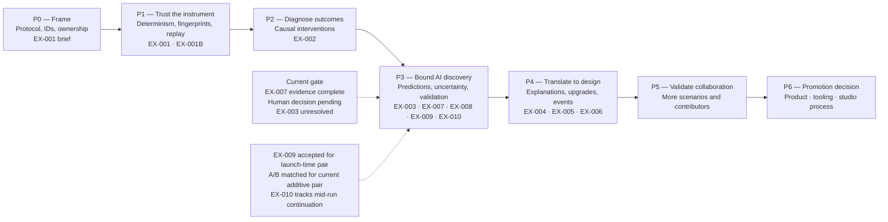
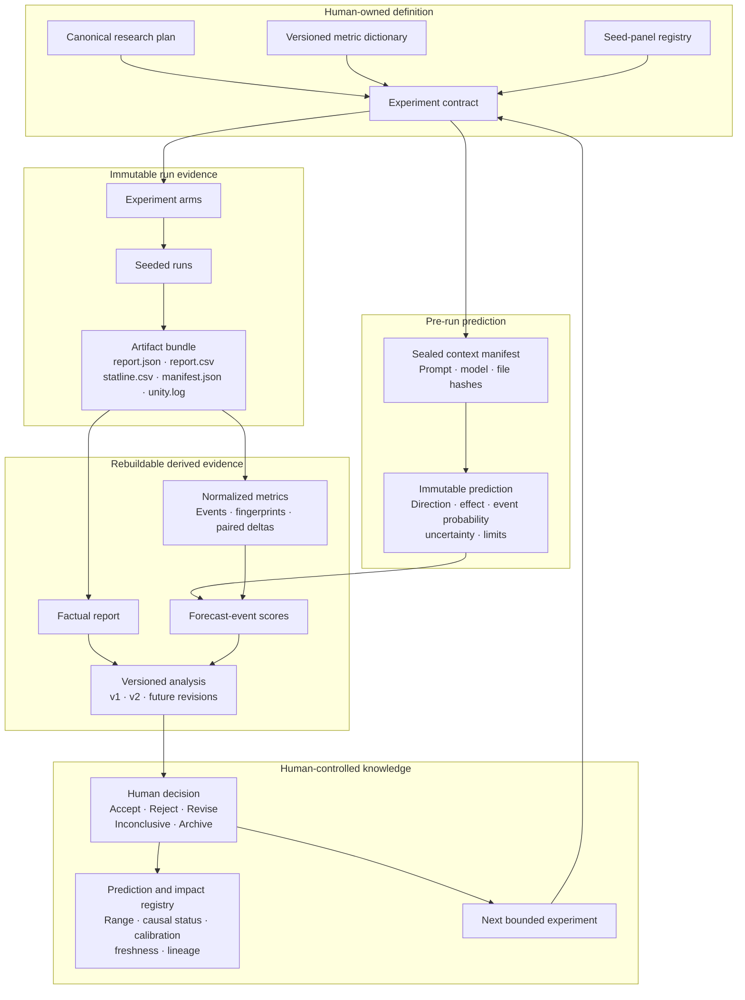
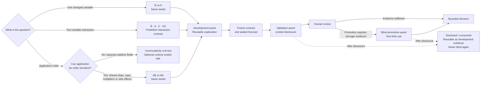

# Predictive AI research architecture and flows

> Status: Needs Review  
> Last reviewed: 2026-09-04
> Scope: Program roadmap, experiment operation, evidence lineage, and experiment selection

These diagrams summarize the current Predictive AI research program and the
second-pass research treatment. They do not promote an AI interpretation into
an accepted project decision. The research plan, immutable run evidence, and
recorded human decisions remain authoritative.

## 1. Program roadmap



## 2. End-to-end operating loop

```mermaid
sequenceDiagram
    participant H as Human owner
    participant C as Experiment contract
    participant A as AI
    participant T as Unity / CellSim tooling
    participant E as Evidence system

    H->>C: Define question, scope, endpoints and decision rule
    C->>E: Register metrics, seed roles and provenance requirements
    E->>A: Supply sealed baseline and permitted context
    A-->>E: Record prediction, limits and defined confidence events
    H->>T: Approve the intervention and execution

    T->>T: Run Unity preflight

    alt Preflight fails
        T-->>E: Store failure record
        E-->>H: Report blocker; produce no experimental result
    else Preflight passes
        T->>T: Execute matched-seed arms
        T-->>E: Store immutable run bundles
        E->>E: Validate, normalize and score
        E->>A: Provide factual report and resolved forecast events
        A-->>H: Analysis, uncertainty, misses and possible causes
        H->>E: Accept, reject, revise, archive or mark inconclusive
        E-->>C: Accepted knowledge or next bounded experiment
    end
```

## 3. Evidence and data structure



## 4. Experiment selection and seed governance



## Authoritative sources

- [Predictive AI research plan](../Research/AI_ASSISTED_ECOLOGY_LAB_RESEARCH_PLAN.md)
- [Predictive AI research paper](../Research/AI_ASSISTED_ECOLOGY_LAB_RESEARCH_PAPER.md)
- [Deep-research treatment index](../DeepResearch_Treatement/README.md)
- [Second-pass delta](../DeepResearch_Treatement/SECOND_PASS_DELTA.md)
- [Revised research protocol](../DeepResearch_Treatement/REVISED_PROTOCOL.md)
- [AI-generated reports guideline](../Studio%20Guidelines/AI_GENERATED_REPORTS.md)
