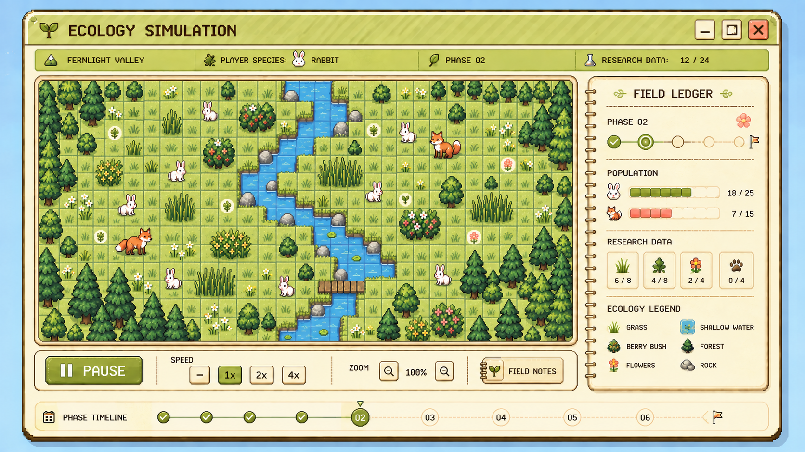

# GalapagOS Simulation View — High-Fidelity Concept v1

> Status: De-facto screen layout and visual north star — approved 2026-09-09
>
> This is a high-fidelity concept reference. It is not production art, a final
> gameplay specification, or a runtime background asset.

## Purpose

This concept establishes the current quality bar for the GalapagOS simulation
view and for future generated UI views. It shows how the simulation should
feel like a readable ecology instrument inside the light GalapagOS desktop,
while keeping the game board visually distinct from the surrounding desktop
art.

Future screen concepts should match this reference's level of finish,
composition, restraint, and authored charm unless a later concept explicitly
supersedes it.

## Layout contract

1. **Native GalapagOS shell** — a pale lime striped title bar, dark-brown
   contrast, and a cream body make the simulation feel like a first-party
   desktop application.
2. **Field header ribbon** — the active biome, species, phase, and research
   context sit in a compact metadata band above the board.
3. **Central ecology board** — the board is the visual priority. It uses small,
   uniform, orthogonal square cells with visible seams and a readable stream,
   terrain, and species arrangement. The board is not hex-based and should not
   be treated as a decorative illustration.
4. **Field Ledger** — a dedicated right-side panel holds phase, population,
   research, and observation information at a glance.
5. **Control dock** — pause, speed, zoom, and field-note actions are grouped in
   a calm bottom dock that reads as a tool tray rather than a second dashboard.
6. **Phase timeline** — progression through the expedition is visible without
   competing with the active board state.

## Visual rules

- Use vanilla cream, pale meadow greens, light olive, and dark brown as the
  structural palette.
- Use coral, pollen, sky blue, petal, lilac, and bronze as restrained semantic
  accents.
- Keep the board-first hierarchy: the board, selected species, current phase,
  and next meaningful action should be understood before decorative detail.
- Use crisp, deliberate pixel clusters and clean shapes. Details should support
  observation, not turn the screen into a dense illustration.
- Keep the shell and board separable. Environmental art may frame the view,
  but must not absorb or obscure the interactive game surface.
- Use text, icon, shape, and color together for ecological roles and state;
  color must never carry meaning alone.

## Reusable language to carry forward

The following elements should be treated as recurring design vocabulary for
future concepts and implementation work:

- striped GalapagOS window shell;
- pale cream inset panels with rounded corners;
- dark-brown structural strokes and typography;
- orthogonal ecology board tiles and seam treatment;
- field-ledger cards and compact metric rows;
- phase/progression timeline;
- bottom control dock;
- small, readable ecology glyphs;
- restrained paper, field-note, and specimen-label flourishes.

## Relationship to implementation

This image is a composition and quality reference only. Runtime views should
continue to use the authored board state, reusable XAML controls, and artist-
owned production assets. Do not ship the generated image as the game board or
use it as a substitute for interactive simulation state.

## Provenance and acceptance

- Source: Codex image-generation workflow, final corrected concept revision.
- Human decision: accepted as the de-facto simulation layout and current visual
  north star on 2026-09-09.
- Repository artifact: `GalapagOS_Simulation_View_High_Fidelity_v1.png`.
- Limitation: the generated image is reference material only and still needs
  artist-authored production assets and implementation-specific review.
