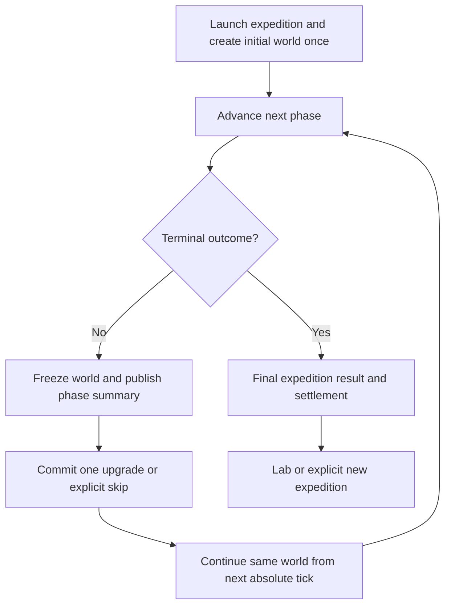

# Consecutive simulation phases — architecture review and migration plan

**Status:** CF-0 is complete. CF-1 lifecycle and the controlled CF-2/CF-3 preview path are implemented locally; current Unity-suite revalidation remains pending while the editor is open. CF-4 through CF-6 remain gated.
**Reviewed:** 2026-09-04, branch `NF/ConsecutiveRuns`, source review baseline `f8ccbdb4`.
**Product and implementation owner:** Josh. **Stat contract reviewer:** Sim.
**Analysis:** Codex; source inspection, existing artifact inspection, and the baseline checks recorded in the handoff. The CF-0 contract below is locked by Josh; runtime packages and balance changes remain separate implementation decisions.

## Outcome and terminology

One expedition owns one evolving ecosystem. At each simulation-phase boundary,
the ecosystem freezes while the player buys an upgrade or skips it. Continue
advances that same ecosystem under the resulting rules. It does not generate a
new board, reset creatures, change the initial seed, or erase earlier history.
This same-world direction and the CF-0 contract are locked. The first runtime
lifecycle, boundary-upgrade and player-flow slices now consume that contract;
telemetry windows, checkpoint replay and research execution remain separate
implementation tasks.

Use these terms consistently:

| Term | Meaning |
| --- | --- |
| Expedition / gameplay run | One launch through terminal results, containing consecutive phases. |
| Phase / segment | A bounded observation window within that expedition; 200 ticks is the current product target, while the prototype exposes the phase length for tuning. |
| Decision boundary | A frozen, completed-tick state; one upgrade or an explicit skip can be committed. |
| Research run | One execution under an experiment contract; it can deliberately be a fresh single window or a multi-phase expedition. |
| Restart / new expedition | An explicit destructive-in-game action that discards the current expedition; never an alias for Continue. |
| Checkpoint | Sufficient state for deterministic research reproduction; distinct from a player-facing disk save. |

## Locked CF-0 contract (2026-09-04)

Josh approved the following decisions for the migration. They define the
behavior that CF-1 through CF-6 must implement; they do not claim that those
runtime packages are already complete.

| Lifecycle point | Locked transition and effect |
| --- | --- |
| Fresh launch | Create the expedition origin and initial world once. Starting population, starting energy and starting reserve effects are eligible here only. |
| Running | Advance the retained runner from the next absolute tick. The current grid, prior source grid, entity identities, cooldowns, resources, history and cumulative raw counters remain in place. |
| Frozen decision boundary | After the exact completed phase tick, freeze the world and publish one phase result. No simulation tick, healing, refill, regrowth or respawn occurs while frozen; any explicitly defined boundary accounting is idempotent and recorded once. |
| Continue | Purchase one valid upgrade or commit an explicit Skip, then resume the same world at the next absolute tick with the new effective rules. Continue never calls the initial-grid factory. |
| Explicit End | From Running or the frozen boundary, finalize the expedition once with its current state and settlement status. No later upgrade or Continue is legal. |
| Restart | A deliberate developer action abandons the current attempt and starts a new expedition from the original launch configuration with a new attempt identity. It is not a phase retry; retry semantics require a separately recorded checkpoint and reward rollback contract. |
| Terminal completion | Extinction, the final product phase, or explicit End moves the expedition to Complete exactly once. A terminal result does not offer another upgrade. |

The product cadence is ten phases, with 200 ticks as the current per-phase
gameplay target, while the current prototype presentation remains a configurable
phase length. Fresh
single-window research remains a declared independent mode of the same step
engine.

Initialization-only upgrades (including starting population, starting energy
and starting reserve) are launch-only. They are not offered as if they mutate
existing creatures at a decision boundary. Live behavior modifiers take effect
on the next tick after acquisition and do not grant a refill, heal, cooldown
reset, or replay of past opportunities.

When a signed maximum-energy change makes an existing creature temporarily sit
above the new maximum, preserve its current energy exactly at the boundary.
Do not add a migration-time clamp or refill. Subsequent energy gains follow the
normal authored maximum rule; an immediate clamp, loss, or grant would be a
separately specified mechanic with its own telemetry and tests.

### Result and window contract

Each phase result is a bounded observation, not an expedition result. It records
the expedition/attempt and phase identity, `windowStartTickExclusive`,
`windowEndTickInclusive`, actual opening and closing state, raw counter deltas,
timestamped events, the rules/loadout effective in that interval, and every
acquisition decision tick plus effective-from tick. Early End, extinction or a
failed run preserves the actual last tick and marks the phase partial,
invalid, unreconciled or aborted as applicable; it is never padded with
fictional exposure.

The final expedition result records the terminal outcome and absolute tick,
all phase results, the complete acquisition timeline, and aggregated raw
counters. Expedition rates are recomputed from pooled numerators and
denominators; phase ratios are not averaged. Shared boundary samples may be
shown in both adjacent phase summaries, but each event and exposure belongs to
one declared window. These meanings are the contract Stat-Line, predictive AI,
telemetry producers and validators consume.

The product brief's ten-phase termination and the prototype's configurable
viewing cadence are recorded above as locked migration inputs. Do not silently
turn a 20-second phase into a whole expedition.

## Review findings

Priorities describe implementation/release risk, not an assertion that the
requested behavior has already been implemented. Locations refer to the review
baseline; use the named methods after lines move.

| ID | Priority | Observed evidence | Consequence and required change |
| --- | --- | --- | --- |
| CF-01 | P0 | `SpeciesSimulationPreview.PlayNextSimulation` (1023) calls `PrepareNextRun` (1149). That method calls the initial-grid factory with `seed + runNumber`, creates a new run/runner, resets UI flags, and increments `runNumber`. | Both purchase and skip eventually rebuild the ecosystem. Split initial launch from phase continuation; only explicit new-expedition paths may call the factory. |
| CF-02 | P0 | `SimulationRunState` in `SimulationRunResult.cs` (134–299) has one duration, clock, history and `Complete` status. `SpeciesSimulationRunner.AdvanceOneTick` (101) refuses completion and uses `Run.Seed + Run.Tick`; the runner also owns `previousCells`. | Merely copying cells into a new run reuses early random seeds, loses perception history, and changes event ticks. Preserve the runner, absolute tick and prior grid; introduce a resumable phase boundary distinct from terminal completion. |
| CF-03 | P0 | `HandleRunCompleted` (611) creates results, invokes a report event, adds survivor-count currency and offers upgrades for every completion. There is no ten-phase or extinction termination here. `SimulationManager` raises completion only once per runner. | New phases need separate, exactly-once boundary and expedition-end transitions. Otherwise rewards may stop, duplicate, or be offered after extinction. Add terminal precedence and a phase-scoped reward ledger. |
| CF-04 | P0 | Runner data/rules/options are readonly construction inputs. `PurchaseReward` changes progression, while `CreateSimulationData` rereads the selected scenario asset during preparation. | A retained runner would keep old rules unless given an explicit boundary update. Freeze base scenario/configuration once; validate and atomically install the next immutable rules/options snapshot. Do not reread mutable scenario assets each phase. |
| CF-05 | P0 | `CreateHerbivoreStatLine` uses all accumulated deaths/counters; serializer takes population from the first and last history entries. Report upgrade records contain order but no acquisition tick. | A phase-two report can silently mix phase population with expedition counters, or attribute pre-upgrade events to the latest loadout. Version window semantics and record the acquisition timeline before claiming continued-play telemetry is trustworthy. |
| CF-06 | P1 | `Gardeners_SeedPouches.asset` modifies starting reserve and starting energy. `SpeciesInitialGridFactory.CreateCell` reads them; explicit population placement uses reserve zero. Creature offspring in `SpeciesSimulation` (2344–2356) use transferred reproduction energy and reserve zero. | Seed Pouches cannot automatically benefit existing Hares, and cannot simply be described as a newborn bonus. Review initialization-only effects and their existing explicit-population inconsistency. Do not charge for a mid-expedition no-op or invent a refill. |
| CF-07 | P1 | `SpeciesCell` has a process-global entity allocator (146–150); `ShouldAvoidPreContact` hashes entity IDs (795–819). Prior positions also use entity identity. | Cross-process checkpoint replay and forked diagnostics cannot ignore or casually renumber IDs. Make allocation expedition-owned and deterministic, or prove an equivalent explicit identity contract before promising exact replay. The gameplay impact is concrete in the experimental avoidance mode; other modes still need event identity stability. |
| CF-08 | P1 | `TryApplyLaunchUpgrades` updates progression then prepares a run (355–450), but first `StartSimulation` reconstructs progression and prepares again (626–655). | Launch values can survive as baked rules while ordered snapshot provenance is lost. Consolidate launch into one atomic construction path and test nonempty launch loadouts through actual Start. |
| CF-09 | P1 | `PlayModeSimulationResultLogger` writes only `playmode-last-run.*` on completion (16–39). `StopSimulation` clears state through `ResetToStart`; no corresponding partial-report event is present. | Latest-file overwrite cannot represent an expedition or preserve abort evidence. Write immutable phase/final bundles and keep a latest pointer only as a convenience. Record early termination and report-write failure. |
| CF-10 | P1 | Batch runner applies the whole loadout before `RunSimulation` (242); paired runner has independent prior-grid state and terminal guards. CLI/queue wrappers primarily accept launch loadouts; `CellSim.ps1` does not forward the newer authored-asset options. | Headless continuation needs the same boundary operation as gameplay, a schedule contract, and complete option/manifest propagation. Existing independent trials remain explicitly supported. Never silently reinterpret old command lines. |
| CF-11 | P1 | `New-CellSimReport.ps1` (377–393) checks some configuration fields but not lifecycle/metric versions, checkpoint lineage, schedule, or all experimental option values; bundle validator expects one CSV row per seed. | Updating only the JSON producer is insufficient. Comparators, validators, CSV and visual replay must reject unsupported or mismatched lifecycle contracts and validate phases separately from seed count. |
| CF-12 | P1 | GDD describes “run next simulation”; product brief describes ten phases; Sprint 2 calls the launch-time upgrade slice complete and excludes active-run resume. | Clarify committed intent, implemented prototype, and new work separately. Preserve accepted historical delivery evidence and replan continuation explicitly instead of silently marking S2 incomplete or expanding its capacity. |

These are source-supported findings. The report inspected an existing schema-23
EX-009 bundle: one record per seed, 200 ticks, no phase/checkpoint/schedule fields.
It does not claim that new continuation behavior or the proposed fixes were
executed. See the handoff for the current baseline-test result.

## State ownership and implementation contract

Keep the current dependency direction: View → ViewModel → Helper → Domain.
Use explicit methods and existing classes; no global bus, replacement grid
engine, generic modifier framework, or new package is needed.

| Owner | Target responsibility (runtime implementation pending) |
| --- | --- |
| `SimulationRunState` | Current world, base seed, absolute tick, expedition history/metrics, phase index/start/end ticks, lifecycle and terminal outcome. |
| `SpeciesSimulationRunner` | One stepping context for the expedition: current immutable effective rules/options and prior source grid. Boundary rule installation is explicit and legal only while frozen. |
| `SimulationManager` | Fixed-step scheduling and authoritative boundary/end commands. Freeze after the exact completed boundary tick; publish immutable results once. |
| `SpeciesProgression` | Currency and ordered acquired snapshots, validated as part of one decision transaction. The manager coordinates the transaction; the UI does not own its correctness. |
| Preview / helper | Adapt authoring/launch inputs and player commands; do not recreate the expedition on Continue. Preserve serialized Unity references and existing binding compatibility during migration. |
| ViewModels / XAML | Show phase number, phase and expedition time, selected effect, distinct phase/final results, Continue and End expedition. Explicit developer Restart remains distinguishable. |
| Reporting / research | Consume frozen outputs and reproduce scheduled decisions through the domain boundary; scoring remains outside simulation. |

### What survives every boundary

- Current grid dimensions and every cell field: terrain/resource identity and
  energy, passability and movement cost, occupancy/species/entity IDs, health,
  energy, age, food eaten/reserve, alpha flag, behavior and behavior duration,
  attack cooldown. No healing, regrowth, respawn or movement occurs while frozen.
- Previous source grid used for motion-aware perception. `SimulationBoardSnapshot`
  is a presentation projection, not a substitute for a domain checkpoint.
- Initial seed, monotonically increasing absolute tick, deterministic identity
  allocation, combat/opportunity modes and experimental options. Current random
  generation is reconstructed per tick, so seed plus absolute tick is essential;
  there is no need to invent a persistent RNG object for the existing step API.
- Frozen base data; current effective snapshot; ordered acquisition history;
  progression, currency and already-awarded boundary identities.
- Population history, raw counters, event lists and tracked-entity telemetry.
  Preserve accumulated evidence; snapshot window baselines without `Metrics.Clear`.

### Clocks and transitions

Use integer tick boundaries. For the default, phase one covers completed ticks
1–200 and phase two covers 201–400. Simulation seconds derive from tick count
and step interval; viewing speed and wall time are separate. Specify and test
conversion of non-integral duration/step authoring values before replacing the
old float completion condition; retain explicit compatibility for old fixtures.

Locked lifecycle: Ready → Running ↔ Paused; Running → AwaitingDecision at
a nonterminal boundary; AwaitingDecision → Running on Continue; Running or a
boundary → Complete on terminal outcome or explicit end. Boundary selection can
have a pending/committed decision value without adding a second UI state machine.

At a long Unity frame, finish only through the next boundary. Discard remaining
frame accumulator time when entering the reward break, so it cannot consume the
next phase immediately. Ordinary Pause/Resume preserves its substep remainder.
Document and test this deliberate scheduling distinction.

After each tick, check extinction before the normal phase reward. At the final
phase, finalize victory/narrow survival/defeat without offering another upgrade.
The product's ten-phase limit belongs to the expedition; diagnostic fresh runs
retain their specified duration/termination policy. No engine loop should wait
forever when a headless run reaches a decision boundary.

### Upgrade transaction

1. Freeze and capture the completed phase result under its old ruleset.
2. Resolve a stable immutable offer snapshot. Prefer an expedition-frozen catalog
   for reproducible offers; record acquisition values even if authoring changes.
3. Validate target species, availability, prerequisite/exclusion direction,
   duplicate/stacking rules, affordability, numeric constraints, resulting rules
   and phase applicability before spending anything.
4. Atomically commit currency, ordered snapshot/event and effective rules/options;
   or commit explicit Skip without changing rules or balance. A failed command
   changes none of these. Repeated clicks cannot buy or reward twice.
5. Continue at the next absolute tick. A previewed choice does not rewrite the
   previous phase's result. If choice and Continue remain separate UI actions,
   the boundary records whether its decision has already been committed.

Do not reapply the complete loadout to already-upgraded rules. Derive effective
rules from frozen base data plus the ordered loadout, or apply only the newly
validated snapshot with a test proving equivalence. The existing snapshot and
registry contract remain the authority for signed additive values.

For live behavior rules (movement, vision, metabolism, block, crowding and
reproduction), the new rule governs subsequent ticks. It does not restore energy,
erase stress, reset cooldowns or replay past opportunities. The locked
initialization-only policy makes starting-population, starting-energy and
starting-reserve effects eligible only at fresh launch; a direct state grant or
newborn behavior would be a separately specified mechanic. If a signed maximum
energy change leaves an existing creature above the new maximum, preserve its
current energy at the boundary. Do not add hidden clamping or healing during
this migration; later gains use the authored maximum rule.

### Checkpoint and research replay

In-memory continuation should retain the runner; it does not require serializing
and rebuilding the world after every phase. Research checkpoint export/import is
a separate adapter over the same state contract, required before EX-010 execution.
Player disk save/load remains outside the initial slice.

A replayable checkpoint must capture the current and previous grids, absolute
tick and phase position, resolved rules/base data and fingerprints, options,
identity allocator state, acquisition/progression state, and sufficient telemetry
baselines/tracking to reproduce the declared output. Restore only at completed
ticks, validate schema/dimensions/species/configuration and hash integrity, and
deep-copy mutable storage when forking. A seed, final population, display image
or final-grid hash alone cannot restore the world. Hashing and serialization
must have canonical field/order rules and a version.

Keep fresh single-window experiments as a declared mode of the same step engine.
Historical launch-time comparisons do not need artificial reward breaks. Keep
paired-lockstep diagnostics explicitly scoped until their prior grids, opportunity
ledger, identity allocation and schedules support continuation. Unsupported
combinations must fail validation rather than silently restart or fall back.

## Work packages and gates

Effort ranges are planning estimates in focused engineering hours, including
implementation and focused checks. They are not an addition to committed S2
capacity. Assign the work during planning; Sim reviews stat semantics without
inheriting Josh's runtime or research responsibilities.

| Package | Proposed owner | Estimate | Dependency and concrete exit gate |
| --- | --- | ---: | --- |
| CF-0 Contract and fixtures | Josh, with Sim for metrics | 4–6h | **Complete 2026-09-04.** Locked phase/end/restart and initialization-only effect policies; froze the state and report contract; preserved the [fresh legacy fixture](fixtures/continuous-simulation/legacy-fresh-schema-21/README.md) with provenance. |
| CF-1 Continuous domain lifecycle | Josh | 8–12h | **Runtime slice implemented.** Same runner/world, absolute clock and prior grid survive skip boundaries; focused lifecycle tests pass. Current Unity-suite revalidation is pending while the editor is open. |
| CF-2 Boundary upgrades and rewards | Josh | 6–10h | **Boundary mechanics implemented; package remains open.** Phase survivor data is settled once, live and legacy offers install the same immutable snapshots, launch-only offers are blocked, and duplicate decisions are guarded. Phase result/telemetry schema work remains in CF-4. |
| CF-3 Player flow and composition | Josh or explicitly assigned UI owner | 4–6h | **Controlled preview path implemented; package remains open.** Purchase, skip, Continue, explicit End, pause and restart are wired without rebuilding the retained run. Lab routes and full UI/scene validation remain. |
| CF-4 Telemetry and Stat-Line | Named telemetry implementer; Sim reviews, Josh integrates | 8–12h | CF-0/1. Versioned phase/expedition windows, ledgers reconcile, serializer/validator/CSV/UI agree, old/new comparisons guarded. |
| CF-5 Research checkpoints and schedules | Josh | 8–12h | CF-1/2/4. Domain checkpoint round trip and fork isolation pass; gameplay/headless decision schedules match; EX-010 input can be frozen. |
| CF-6 Integrated regression and document closure | Josh, Sim review | 6–10h | CF-1–5. All verification gates, documentation audit and evidence validity notices complete; explicit review decision. |
| Total | Replan capacity explicitly | 44–68h | EX-010 experimental execution/balance work is additional and requires its own approved protocol. |

CF-3 and CF-4 can proceed alongside each other once their shared contract is
stable. Do not release a player continuation change before CF-4: otherwise new
play evidence would still be labelled using old semantics. Checkpoint research
work may be delivered later, but EX-010 remains blocked until CF-5 passes.

## CF-0 closure — contract and fixture

CF-0 is complete. It prepared the shared contract and a versioned compatibility
fixture before anyone changes the live simulation flow. Josh owns the work; Sim
reviews the meaning of phase and expedition measurements.

### Locked outputs

- [x] Lifecycle names and transitions are recorded in the locked contract above.
- [x] Boundary eligibility is launch-only for starting population, starting
      energy and starting reserve; no mid-expedition no-op purchase is implied.
- [x] Phase versus expedition results define raw counters, declared windows,
      partial/invalid states and acquisition decision/effective ticks.
- [x] Above-cap energy is preserved at a signed maximum change; no migration
      clamp or refill is hidden, and later gains use the authored cap rule.
- [x] The [schema-21 fresh legacy report fixture](fixtures/continuous-simulation/legacy-fresh-schema-21/report.json)
      is byte-for-byte preserved with source, configuration and SHA-256
      provenance.

### CF-0 outputs and stop gate

The block is ready to hand to CF-1. The decisions above are recorded, the fresh
fixture has its seed/configuration/schema provenance, and the phase/expedition
fields have one owner and one meaning. No runtime behavior, serialized asset,
report schema, or EX-010 experiment was changed by closing CF-0. Runtime
implementation must consume this contract rather than reopen the same-world
decision or silently introduce a reset fallback.

## Required verification

| Gate | Fixture and assertion |
| --- | --- |
| No-upgrade identity | Compare two adjacent phase windows with 200 + Skip + 200 using the same initial/checkpoint identity. Compare every cell field, prior-grid-sensitive behavior, event order and totals; repeat across the ten-phase expedition. Only boundary metadata may differ. |
| Boundary fidelity | End a phase with damaged/hungry/aged/alpha creatures, depleted resources, an active attack cooldown and moving prey visible to a Tracker. Assert exact frozen state through purchase/skip and no phantom tick at Continue. |
| Command/state validity | Exercise pause at tick 199, exact boundary 200, large delta time, repeated Continue/purchase, invalid purchase, insufficient currency, missing requirements, skip, explicit end and restart. Verify no double payment or reward. |
| Upgrade timing | Control, upgrade at launch, upgrade after tick 200, and skip from a common checkpoint. Confirm the first changed rule is used at tick 201, with no prior event relabelled and no duplicate loadout application. |
| Launch provenance | Launch through Lab with nonempty ordered snapshots and then Start. Check requested seed, rules and full snapshot/order provenance after initialization and after continuation. |
| Termination | Extinction at tick 199 and 200, surviving final phase above/below the authored threshold, voluntary end at a decision, Stop while running/paused. Finalize once; no post-terminal reward/Continue. |
| Checkpoint replay | Export/import at a boundary and resume in a fresh process; compare state and declared report outputs. Two forks cannot mutate one another; interleaving unrelated simulations cannot alter IDs or outcomes. Include avoidance mode. |
| Telemetry arithmetic | Phase opening/closing populations reconcile with births and every removal cause; adjacent windows partition events once; counts sum and rates are recomputed from pooled counts. Preserve N/A/invalid/partial states. |
| Derived-stat edge cases | No predator, no encounter, zero population, successful mating with multiple births, population-cap removal, unequal/partial phase lengths and ruleset changes. Test documented formula limitations rather than changing them to make a run pass. |
| Producer/consumer parity | Schema fixtures for legacy fresh, continued, truncated and incompatible runs; JSON, CSV, Markdown, Stat-Line and UI agree. Comparison rejects missing/incompatible contracts. Report output does not alter simulation. |
| Research equivalence | Same resolved schedule produces matching gameplay/headless checkpoints. EX-009 stays a launch-time mode; paired diagnostics retain their own regression coverage. |
| Unity integration | Existing Edit Mode and Play Mode suites, graphics-capable board/scene checks at 1280×720 and 1920×1080, Windows development build and smoke test. Preserve every `.meta`, GUID and serialized reference. |
| Duration and memory | Verify exact ticks at authored duration conversion edges; measure a ten-phase session and the longest supported diagnostic window. Inspect retained history/events before proposing optimization; never truncate evidence silently. |

Use existing manager/domain/upgrade/player-selection/adapter/catalog tests plus
the presentation, Lab and cave-preview Play Mode suites as the regression base.
Current tests that expect `Complete` after one window remain valid for explicitly
fresh research runs; add phase-boundary expectations for gameplay instead of
blindly changing every completion assertion. Keep island and generic grid/Life
prototypes behaviorally isolated; their resets are unrelated.

## Remaining planning and verification

The CF-0 mechanics and evidence contract are accepted and must not be reopened
as an implementation shortcut. CF-1 and the controlled CF-2/CF-3 runtime slices
now consume them. The remaining work is verification and delivery coordination:

1. Assign CF-1 through CF-6 owners and capacity, keeping Josh responsible for
   lifecycle/report integration and Sim responsible for metric meaning review.
2. Freeze concrete serializer/lifecycle version identifiers from the branch at
   implementation time, then run the producer/consumer parity gates.
3. Approve EX-010's schedule, outcomes and fresh validation panel separately
   after checkpoint capability and the shared report contract are verified.

These items do not change the locked same-world Continue, launch-only effect,
above-cap energy, Restart, or phase/expedition window decisions.

## Proposed concerns for review

These are **proposals**, not newly accepted Feature Concern Guard records or
automatic blocks. Existing UPG-C01/03/04/06 and SPAI-C01–04/06/09 apply within
their recorded scopes; this review does not waive or change them.

| Proposed ID | Severity | Concrete trigger | Consequence | Smallest mitigation / owner |
| --- | --- | --- | --- | --- |
| CF-C01 | Extreme | Continue replaces the world/tick/prior grid, or checkpoint replay omits identity state used by avoidance. | The main continuity/determinism objective fails. | Full-state skip and checkpoint parity gates; Josh. |
| CF-C02 | Extreme | A continued phase is compared/scored using fresh-run or mixed-window telemetry without explicit compatibility. | Evidence can appear authoritative while answering a different question. | Lifecycle/window versions and comparison rejection; Josh + Sim. |
| CF-C03 | Extreme | Completion, retry or double-click can settle the same phase/expedition more than once. | Currency and progression outcomes become invalid. | Atomic, phase-keyed settlement and invalid-transition tests; Josh. |
| CF-C04 | Mild | Starting-only modifiers remain offered mid-expedition without a defined effect. | A paid choice can have no effect or misleading copy. | Restrict eligibility until a reviewed mechanic exists; Josh. |
| CF-C05 | Mild | Whole-expedition events are retained beyond measured supported duration without a retention decision. | Memory/report growth can make long sessions unusable. | Measure the supported horizon and keep any limits explicit; Josh. |

## Integration, rollback and completion

Use a focused `codex/` branch/worktree when implementation is scheduled. Capture
the then-current baseline and coordinate edits to metrics with Sim first. Land
reviewable packages through explicit interfaces; preserve old report readers
and new/legacy mode labels until consumer parity is proven. Do not move Unity
assets as part of the lifecycle change.

Rollback reverts the new implementation within its branch and retains all new
artifacts under their own lifecycle versions. Do not relabel continuation data
as legacy data or rewrite accepted experiment results to make rollback compare.
Do not add a hidden production reset fallback if Continue fails validation.

Implementation is complete only when the gates pass, product and mechanics docs
match actual behavior, the Stat-Line and research owners have reviewed their
contracts, affected board records reflect the integration state, and the old
evidence boundaries remain discoverable. A green old single-window suite alone
does not close this migration.

- [Stat-Line, predictive AI and telemetry impact](CONTINUOUS_SIMULATION_EVIDENCE_IMPACT.md)
- [Documentation coverage and closure checklist](CONTINUOUS_SIMULATION_DOCUMENTATION_AUDIT.md)
- [Product brief](PRODUCT_BRIEF.md) and [GDD](GDD_TEMPLATE.md)
- [Upgrade concern record](Planning%20Concerns/upgrade-system.md)
- [Stat-Line / predictive AI concern record](Planning%20Concerns/STATLINE_PREDICTIVE_AI_CROSSOVER.md)
