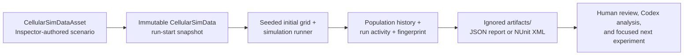

# Unity simulation tooling

This is the repeatable execution layer for the cellular-automata prototype. It
turns an Inspector-authored scenario, a set of seeds, and the same simulation
code used by the game into reviewable test results and JSON experiment reports.

> **Current status:** ready for a closed-editor batch run. The tools deliberately
> refuse to start when this Unity project has an active `Temp/UnityLockfile`; they
> never close Unity or touch unsaved editor work.



## What this enables

### Reliable development feedback

- Run the project’s Edit Mode and Play Mode tests from a reproducible PowerShell
  entry point rather than relying on a manually configured Unity window.
- Give a developer or coding agent concrete NUnit XML and Unity logs to inspect
  after a failure.
- Detect the project’s Unity version from `ProjectSettings/ProjectVersion.txt`;
  pass `-UnityPath` only when Unity is installed somewhere nonstandard.
- Keep experimental output outside source control in `artifacts/`, so generated
  reports and visual evidence never create noisy changes or accidental commits.

### Deterministic simulation experiments

- Run one scenario across a contiguous, explicit seed range.
- Reproduce an individual result using its seed and the report’s ruleset
  fingerprint.
- Compare two scenario revisions with the same seed range instead of judging
  balance from unrelated random runs.
- Capture the full population history for every known species and each tick,
  plus final minimum, maximum, average, and extinction-rate summaries.
- Capture per-species run activity: births, food actually consumed, movement,
  combat damage/kills, total deaths, and directly resolved mortality causes.
  Plant births include successful seed drops.
- Use either a `CellularSimDataAsset` in `Assets/` or a fresh default scenario
  snapshot. Neither path mutates active runtime state.
- Support arbitrary species IDs already defined by `CellularSimData`; reports do
  not assume plant, herbivore, and carnivore are the only possible entries.

### Better human and AI collaboration

- Turn a balance question into a small, auditable experiment: name the scenario,
  hold the seed range fixed, make one change, then compare the JSON reports.
- Let an agent inspect source, invoke the same commands when Unity is closed,
  and explain results from recorded evidence instead of a visual guess.
- Keep the shipping domain code free of editor automation. Batch-only concerns
  live under `Assets/Editor/SimulationTools/`; shell orchestration lives under
  `tools/`.
- Capture optional graphics-enabled Play Mode checkpoints for review without
  changing the normal headless test path.

## Commands

Run these from the Unity project root, `LearningIndieDev`:

```powershell
# PowerShell (the .\ prefix runs the project-local command).
.\CellSim.cmd Help
.\CellSim.cmd Test
.\CellSim.cmd Test -Mode EditMode
.\CellSim.cmd Visuals
.\CellSim.cmd Visuals -ReplayReportPath artifacts\cellular-experiment-...\report.json -ReplaySeed 10100
.\CellSim.cmd Run
.\CellSim.cmd Run -SeedCount 50
.\CellSim.cmd Report
.\CellSim.cmd Baseline -SeedCount 20
.\CellSim.cmd Compare -BaselinePath artifacts\cellular-experiment-...\report.json -ReportPath artifacts\cellular-experiment-...\report.json
```

`CellSim.cmd` launches PowerShell with a process-only execution-policy bypass; it
does not change the machine's saved policy. It dispatches to the underlying
commands below when their full options are needed:

| Command | Use it for |
| --- | --- |
| `CellSim Test` | Run all Unity tests; add `-Mode EditMode` or `PlayMode` for a focused suite. |
| `CellSim Visuals` | Run the PlayMode suite and capture settings, late-running, rewards, and results PNGs from the cellular preview; use `-TestFilter` to focus it. Add `-ReplayReportPath ... -ReplaySeed ...` to replay one headless report result with its scenario, player species, seed, and grid settings. |
| `CellSim Run` | Generate a JSON report for a seed range. |
| `CellSim Report` | Turn the latest JSON experiment into readable Markdown. |
| `CellSim Baseline` | Run all tests, then an experiment and its Markdown report in one command. |
| `CellSim Compare` | Compare two explicit reports. Matching seed ranges are required for an A/B balance conclusion. |

```powershell
# Both Unity test suites.
powershell -NoProfile -ExecutionPolicy Bypass -File .\tools\Invoke-UnityTests.ps1

# One test suite when the change is domain-only or scene/UI-only.
powershell -NoProfile -ExecutionPolicy Bypass -File .\tools\Invoke-UnityTests.ps1 -Mode EditMode
powershell -NoProfile -ExecutionPolicy Bypass -File .\tools\Invoke-UnityTests.ps1 -Mode PlayMode

# Graphics-enabled prototype checkpoints; Unity must be closed.
powershell -NoProfile -ExecutionPolicy Bypass -File .\tools\Invoke-UnityVisualEvidence.ps1 `
    -UnityPath 'F:\Editor\6000.4.6f1-x86_64\Editor\Unity.exe'

# Focus the visual run on one test when needed; the default runs all PlayMode tests.
powershell -NoProfile -ExecutionPolicy Bypass -File .\tools\Invoke-UnityVisualEvidence.ps1 `
    -UnityPath 'F:\Editor\6000.4.6f1-x86_64\Editor\Unity.exe' `
    -TestFilter 'SaltyGame.PlayModeTests.CavePreviewPlayModeTests.CellularAutomataPrototypeCreatesAndAnimatesTheSpeciesPreview'

# Replay one selected seed from a headless report; Unity must be closed.
powershell -NoProfile -ExecutionPolicy Bypass -File .\tools\Invoke-UnityVisualEvidence.ps1 `
    -UnityPath 'F:\Editor\6000.4.6f1-x86_64\Editor\Unity.exe' `
    -ReplayReportPath artifacts\cellular-experiment-...\report.json `
    -ReplaySeed 10100 `
    -TestFilter 'SaltyGame.PlayModeTests.CavePreviewPlayModeTests.CellularAutomataPrototypeCreatesAndAnimatesTheSpeciesPreview'

# Twenty default-scenario runs, seeds 1 through 20.
powershell -NoProfile -ExecutionPolicy Bypass -File .\tools\Run-CellularExperiment.ps1

# Compare an authored scenario over a controlled seed range.
powershell -NoProfile -ExecutionPolicy Bypass -File .\tools\Run-CellularExperiment.ps1 `
    -ScenarioPath Assets/Simulation/Scenarios/Example.asset `
    -SeedStart 1000 `
    -SeedCount 50 `
    -PlayerSpeciesId herbivore
```

Each invocation makes a timestamped directory below `artifacts/`:

| Command | Output |
| --- | --- |
| `Invoke-UnityTests.ps1` | NUnit XML and a Unity log for each requested test platform |
| `Invoke-UnityVisualEvidence.ps1` | PlayMode NUnit XML, Unity log, four PNG checkpoints, and `replay-manifest.json` when replaying a report seed |
| `Run-CellularExperiment.ps1` | `report.json` plus the Unity batch log |
| `New-CellSimReport.ps1` | Readable `analysis.md` beside the selected JSON report |

The experiment JSON records the schema version, timestamp, scenario asset path,
seed range, grid settings, player species, ruleset fingerprint, run-level
results, full population timelines, final-population summary, and per-species
activity totals. The generated Markdown report adds start/midpoint/end average
populations, average activity and mortality tables, per-seed outcomes, and
optional test-suite or comparison summaries.

`CellSim Baseline` combines the normal test suite, a seeded experiment, and a
readable Markdown analysis into one command. `CellSim Report` analyzes the most
recent experiment by default; `CellSim Compare` adds population and extinction
rate deltas against an explicitly selected baseline report.

## Authoring workflow

`CellularSimDataAsset` remains supported as the compact Inspector authoring path.
For reusable species libraries and multi-species experiments, use
`ScenarioDefinitionAsset`, which references `SpeciesDefinitionAsset` assets:

1. Create or select a **Salty Game / Cellular Simulation Data** asset.
2. Configure its global settings and species definitions.
3. Run the scene normally for visual iteration, or close Unity and run a seed
   batch with `Run-CellularExperiment.ps1`.
4. Compare reports using the same seed range. Promote a promising revision only
   after its observed change is explainable.

The asset creates a fresh immutable `CellularSimData` snapshot for every run.
Editing the asset affects a future run, never one that is already underway.

## Safety and ownership

| Guardrail | Reason |
| --- | --- |
| Batch commands fail when Unity is open | Prevent contention, asset import races, and lost unsaved work. |
| `artifacts/` is ignored | Keep generated logs and reports local and disposable. |
| Reports require an output path below `artifacts/` | Prevent a batch command from writing arbitrary project files. |
| Scenario data becomes an immutable runtime snapshot | Make runs comparable and prevent data edits from changing an active result. |
| Species IDs and dictionary inputs are sorted at initialization | The same seed and logically identical ruleset produce the same initial grid regardless of dictionary insertion order. |

## Deliberate limits

This is an execution and evidence spine, not a simulation-engine rewrite. It
does **not** add a graphing dashboard, automated fun scoring, runtime rule
plugins, scent, generalized diet lists, custom terrain asset authoring, or a
custom Codex-to-Unity communication service. Those should be introduced only
when a concrete experiment requires them.

For current and deferred cellular-simulation work, see
[`CELLULAR_SIM_TODOS.md`](CELLULAR_SIM_TODOS.md). For the longer-term analytics
and automation ideas this tooling supports, see
[`SPECIES_IDEAS_SCRATCHPAD.md`](SPECIES_IDEAS_SCRATCHPAD.md).

## Troubleshooting

- **"Unity appears to be open"**: save and close the project in Unity, wait for
  the lock file to clear, and rerun. Do not delete `Temp/UnityLockfile` while
  Unity is active.
- **"Could not find Unity"**: pass the editor executable explicitly, for example
  `-UnityPath 'C:\Program Files\Unity\Hub\Editor\6000.4.6f1\Editor\Unity.exe'`.
- **A batch run fails**: read the log adjacent to the XML or JSON result first;
  it contains Unity compiler and Test Runner details.
- **A scenario cannot be found**: pass a project-relative `Assets/...` path to a
  `CellularSimDataAsset`, not an operating-system path outside the project.
