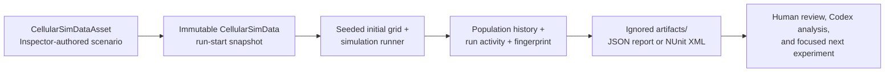

# Unity simulation tooling

This is the repeatable execution layer for the cellular-automata prototype. It
turns an Inspector-authored scenario, a set of seeds, and the same simulation
code used by the game into reviewable test results and JSON experiment reports.

**Consecutive-phase migration notice (2026-09-04):** the current batch contract
is a fresh simulation window; Play Mode writes its latest completed window.
Neither is a checkpoint/acquisition-timeline contract. Planned continuation
requires versioned phase and expedition outputs, immutable artifact lineage,
scheduled upgrades and compatible readers/validators. Existing commands keep
their declared fresh-run meaning. See the [migration plan](CONTINUOUS_SIMULATION_FLOW_PLAN.md)
and [evidence validity register](CONTINUOUS_SIMULATION_EVIDENCE_IMPACT.md).
Do not use old reports as evidence of continued-world behavior.

> **Current status:** ready for a closed-editor batch run. The tools deliberately
> refuse to start when this Unity project has an active `Temp/UnityLockfile`.
> They never close a pre-existing editor or touch unsaved editor work; each
> batch invocation cleans only the Unity process tree and helper processes it
> started.



## What this enables

### Reliable development feedback

- Run the project’s Edit Mode and Play Mode tests from a reproducible PowerShell
  entry point rather than relying on a manually configured Unity window.
- Give a developer or coding agent concrete NUnit XML and Unity logs to inspect
  after a failure.
- Detect the project’s Unity version from `ProjectSettings/ProjectVersion.txt`;
  pass `-UnityPath` only when Unity is installed somewhere nonstandard.
- Keep experimental output outside source control in `artifacts/`, so generated
  reports and visual evidence never create noisy changes or accidental commits.
- A completed `SpeciesSimulationPreview` Play Mode run now automatically writes
  `artifacts/playmode-last-run.json` and `artifacts/playmode-last-run.md`. The
  JSON keeps the full per-tick population history, ruleset fingerprint, seed,
  scenario path, per-species activity, behavior-state ticks, tracked entity
  transitions, per-death cause events, and the ordered per-run upgrade contract
  snapshots (including modifier values and fingerprints); the Markdown is the
  quick human/agent summary. The Play Mode report schema is 7 after this
  addition; older reports remain readable as historical artifacts.

### Deterministic simulation experiments

- Run one scenario across a contiguous, explicit seed range.
- Reproduce an individual result using its seed and the report’s ruleset
  fingerprint.
- Compare two scenario revisions with the same seed range instead of judging
  balance from unrelated random runs.
- Capture the full population history for every known species and each tick,
  plus final minimum, maximum, average, and extinction-rate summaries.
- Capture per-species run activity: births, food actually consumed, movement,
  combat damage/kills, total deaths, directly resolved mortality causes, and a
  reconciled reproduction funnel. The funnel classifies each reproduction
  candidate once as energy-, mate-, group-, chance-, or space-blocked, or as a
  successful attempt. Plant births include successful seed drops.
- Use either a `CellularSimDataAsset` in `Assets/` or a fresh default scenario
  snapshot. Neither path mutates active runtime state.
- Support arbitrary species IDs already defined by `CellularSimData`; reports do
  not assume plant, herbivore, and carnivore are the only possible entries.

### Better human and AI collaboration

- Turn a balance question into a small, auditable experiment: name the scenario,
  hold the seed range fixed, make one change, then compare the JSON reports.
- Let an agent inspect source, invoke the same commands when Unity is closed,
  and explain results from recorded evidence instead of a visual guess.
- Keep the shipping domain code free of editor automation. Batch-only concerns
  live under `Assets/Editor/SimulationTools/`; shell orchestration lives under
  `tools/`.
- Capture optional graphics-enabled Play Mode checkpoints for review without
  changing the normal headless test path.

## Commands

Run these from the Unity project root, `LearningIndieDev`:

```powershell
# PowerShell (the .\ prefix runs the project-local command).
.\CellSim.cmd Help
.\CellSim.cmd Test
.\CellSim.cmd Test -Mode EditMode
.\CellSim.cmd Visuals
.\CellSim.cmd Visuals -ReplayReportPath artifacts\cellular-experiment-...\report.json -ReplaySeed 10100
.\CellSim.cmd Run
.\CellSim.cmd Run -SeedCount 50
.\CellSim.cmd Run -RunTicks 100
.\CellSim.cmd Run -RunDurationSeconds 60 -StepIntervalSeconds 0.1
.\CellSim.cmd Run -ScenarioPath Assets/Data/CellularSimulation/Scenarios/ForestEdge.asset -PlayerSpeciesId hare -ExperimentalFeatures bev-experimental -CombatMode opposed-roll -UpgradeId tough-hide
.\CellSim.cmd Run -ScenarioPath Assets/Data/CellularSimulation/Scenarios/ForestEdge.asset -PlayerSpeciesId hare -ExperimentalFeatures bev-experimental -CombatMode opposed-roll -UpgradeSequence tough-hide,tough-hide
.\CellSim.cmd Run -ScenarioPath Assets/Data/CellularSimulation/Scenarios/ForestEdge.asset -PlayerSpeciesId hare -ExperimentalFeatures bev-experimental -CombatMode opposed-roll -UpgradeId threat-exposure -UpgradeValueOverride 0.75
.\CellSim.cmd Run -ScenarioPath Assets/Data/CellularSimulation/Scenarios/ForestEdge.asset -PlayerSpeciesId hare -ExperimentalFeatures bev-experimental -CombatMode opposed-roll -UpgradeId threat-exposure -UpgradeValueOverride 0.75 -PreContactAvoidanceChance 0.10
.\CellSim.cmd Report
.\CellSim.cmd Baseline -SeedCount 20
.\CellSim.cmd Compare -BaselinePath artifacts\cellular-experiment-...\report.json -ReportPath artifacts\cellular-experiment-...\report.json
.\CellSim.cmd Validate -ReportPath artifacts\cellular-experiment-...\report.json
```

Threat Exposure progression is capped at level 10. Level 1 grants `+0.75`
flee speed and `+0.08` avoidance; each level through level 10 adds another
`+0.08` avoidance, reaching a maximum of `0.80`. The legacy ID
`threat-response` remains accepted for historical reports and loadouts.

`CellSim.cmd` launches PowerShell with a process-only execution-policy bypass; it
does not change the machine's saved policy. It dispatches to the underlying
commands below when their full options are needed:

| Command | Use it for |
| --- | --- |
| `CellSim Test` | Run all Unity tests; add `-Mode EditMode` or `PlayMode` for a focused suite. |
| `CellSim Visuals` | Run the PlayMode suite and capture settings, late-running, rewards, and results PNGs from the cellular preview; use `-TestFilter` to focus it. Add `-ReplayReportPath ... -ReplaySeed ...` to replay one headless report result with its scenario, player species, seed, and grid settings. |
| `CellSim Run` | Generate a JSON report for a seed range; `-RunTicks` sets the exact tick count (200 by default), while `-RunDurationSeconds` and `-StepIntervalSeconds` remain available for legacy duration-based runs. These options override the run window without changing the authored scenario asset. |
| `CellSim Report` | Turn the latest JSON experiment into readable Markdown. |
| `CellSim Baseline` | Run all tests, then an experiment and its Markdown report in one command. |
| `CellSim Compare` | Compare two explicit reports. Matching seed ranges are required for an A/B balance conclusion. |
| `CellSim Validate` | Independently recalculate and cross-check the herbivore slash-line in a report. |

`CellSim Run` accepts signed 32-bit seeds, including negative seeds retained in
older diagnostic reports, so an individual historical run can be replayed
without remapping its seed.

```powershell
# Both Unity test suites.
powershell -NoProfile -ExecutionPolicy Bypass -File .\tools\Invoke-UnityTests.ps1

# One test suite when the change is domain-only or scene/UI-only.
powershell -NoProfile -ExecutionPolicy Bypass -File .\tools\Invoke-UnityTests.ps1 -Mode EditMode
powershell -NoProfile -ExecutionPolicy Bypass -File .\tools\Invoke-UnityTests.ps1 -Mode PlayMode

# Graphics-enabled prototype checkpoints; Unity must be closed.
powershell -NoProfile -ExecutionPolicy Bypass -File .\tools\Invoke-UnityVisualEvidence.ps1 `
    -UnityPath 'F:\Editor\6000.4.6f1-x86_64\Editor\Unity.exe'

# Focus the visual run on one test when needed; the default runs all PlayMode tests.
powershell -NoProfile -ExecutionPolicy Bypass -File .\tools\Invoke-UnityVisualEvidence.ps1 `
    -UnityPath 'F:\Editor\6000.4.6f1-x86_64\Editor\Unity.exe' `
    -TestFilter 'SaltyGame.PlayModeTests.CavePreviewPlayModeTests.CellularAutomataPrototypeCreatesAndAnimatesTheSpeciesPreview'

# Replay one selected seed from a headless report; Unity must be closed.
powershell -NoProfile -ExecutionPolicy Bypass -File .\tools\Invoke-UnityVisualEvidence.ps1 `
    -UnityPath 'F:\Editor\6000.4.6f1-x86_64\Editor\Unity.exe' `
    -ReplayReportPath artifacts\cellular-experiment-...\report.json `
    -ReplaySeed 10100 `
    -TestFilter 'SaltyGame.PlayModeTests.CavePreviewPlayModeTests.CellularAutomataPrototypeCreatesAndAnimatesTheSpeciesPreview'

# Twenty default-scenario runs, seeds 1 through 20.
powershell -NoProfile -ExecutionPolicy Bypass -File .\tools\Run-CellularExperiment.ps1

# 1,000 runs on a 64x64 grid; JSON and Excel-ready CSV are written together.
powershell -NoProfile -ExecutionPolicy Bypass -File .\tools\Run-CellularExperiment.ps1 `
    -ScenarioPath Assets/Data/CellularSimulation/Scenarios/ForestEdge.asset `
    -SeedStart 1 `
    -SeedCount 1000 `
    -GridWidth 64 `
    -GridHeight 64 `
    -PlayerSpeciesId hare

# Compare an authored scenario over a controlled seed range.
powershell -NoProfile -ExecutionPolicy Bypass -File .\tools\Run-CellularExperiment.ps1 `
    -ScenarioPath Assets/Simulation/Scenarios/Example.asset `
    -SeedStart 1000 `
    -SeedCount 50 `
    -PlayerSpeciesId herbivore

# Matched control/upgrade arm; use the same seeds for both invocations.
powershell -NoProfile -ExecutionPolicy Bypass -File .\tools\Run-CellularExperiment.ps1 `
    -ScenarioPath Assets/Data/CellularSimulation/Scenarios/ForestEdge.asset `
    -SeedStart 10100 `
    -SeedCount 20 `
    -PlayerSpeciesId hare `
    -UpgradeId faster-movement

# Diagnostic protection arm; use the same seeds for control and trial.
powershell -NoProfile -ExecutionPolicy Bypass -File .\tools\Run-CellularExperiment.ps1 `
    -ScenarioPath Assets/Data/CellularSimulation/Scenarios/ForestEdge.asset `
    -SeedStart 10100 `
    -SeedCount 20 `
    -PlayerSpeciesId hare `
    -UpgradeId stronger-block-2

# Experimental herbivore upgrade arm.
powershell -NoProfile -ExecutionPolicy Bypass -File .\tools\Run-CellularExperiment.ps1 `
    -ScenarioPath Assets/Data/CellularSimulation/Scenarios/ForestEdge.asset `
    -SeedStart 10100 `
    -SeedCount 20 `
    -PlayerSpeciesId hare `
    -ExperimentalFeatures bev-experimental `
    -CombatMode opposed-roll `
    -UpgradeId tough-hide

# Repeated purchases model a higher upgrade level in one fixed-loadout run.
powershell -NoProfile -ExecutionPolicy Bypass -File .\tools\Run-CellularExperiment.ps1 `
    -ScenarioPath Assets/Data/CellularSimulation/Scenarios/ForestEdge.asset `
    -SeedStart 10100 `
    -SeedCount 20 `
    -PlayerSpeciesId hare `
    -ExperimentalFeatures bev-experimental `
    -CombatMode opposed-roll `
    -UpgradeSequence tough-hide,tough-hide

# Research arm backed by the production Scriptable Object catalog. The adapter
# resolves these IDs to immutable snapshots, applies those same values to the
# run, and records the snapshot metadata in report.json.
powershell -NoProfile -ExecutionPolicy Bypass -File .\tools\Run-CellularExperiment.ps1 `
    -ScenarioPath Assets/Data/CellularSimulation/Scenarios/ForestEdge.asset `
    -SeedStart 10100 `
    -SeedCount 20 `
    -PlayerSpeciesId hare `
    -UpgradeAssetSequence trailblazer-long-stride,warren-guarded-burrow

# Opt-in D&D-style opposed combat arm; legacy fixed damage remains the default.
powershell -NoProfile -ExecutionPolicy Bypass -File .\tools\Run-CellularExperiment.ps1 `
    -ScenarioPath Assets/Data/CellularSimulation/Scenarios/ForestEdge.asset `
    -SeedStart 10100 `
    -SeedCount 20 `
    -PlayerSpeciesId hare `
    -CombatMode opposed-roll
```

Each invocation makes a timestamped directory below `artifacts/`:

| Command | Output |
| --- | --- |
| `Test-UnityPreflight.ps1` | Lock/process cleanup, entitlement check, bounded licensing probe, and a preserved probe log |
| `Invoke-UnityTests.ps1` | NUnit XML and a Unity log for each requested test platform |
| `Invoke-UnityVisualEvidence.ps1` | PlayMode NUnit XML, Unity log, four PNG checkpoints, and `replay-manifest.json` when replaying a report seed |
| `Run-CellularExperiment.ps1` | `report.json`, one-row-per-seed `report.csv`, `manifest.json`, plus the Unity batch log |
| `Test-CellSimArtifactBundle.ps1` | Validates required files, report/run/CSV row counts, report hash, and provenance fields before analysis |
| `New-CellSimReport.ps1` | Readable `analysis.md` beside the selected JSON report |

Experiment report schema 23 keeps `rulesetFingerprint` as the scenario-data
identity and adds `runProvenanceFingerprint` for the effective execution
configuration: scenario fingerprint, combat mode, attack-opportunity mode,
experimental feature/cooldown/avoidance chance, and ordered loadout. The sibling
manifest records the report SHA-256, source commit and dirty state, scenario
asset path/GUID, and the Unity argument vector. `sourceTreeDirty` is the
pre-run state; explicit `sourceTreeDirtyBeforeRun` and
`sourceTreeDirtyAfterRun` fields make the execution window auditable. Report
hashes use canonical UTF-8 JSON with LF line endings so Git checkout
normalization cannot invalidate an otherwise matching artifact. Copy the
complete artifact directory when retaining evidence; a handoff summary alone
is not independently auditable raw evidence.

Use `-UpgradeAssetSequence` when a research arm should consume authored
Scriptable Object values. The comma-separated IDs are resolved from the
production catalog by `SpeciesUpgradePredictionInputAdapter`; unknown or
duplicate IDs fail before the run starts. For a research-only fixture catalog,
add `-UpgradeAssetCatalogPath Assets/...` so the same adapter resolves the
declared fixture assets without replacing them with production values. The
report includes `predictionInput` with the source catalog path, each ordered
snapshot's modifiers and fingerprints, plus `upgradeLoadoutFingerprint`. The
older `-UpgradeId` and `-UpgradeSequence` arguments remain available for
historical experiments and diagnostic arms.

The current experiment JSON schema is `23`. Historical schema-6 EX-002 and
schema-7 baseline reports remain valid for their bounded matrices; new outputs
record the schema version,
timestamp, scenario asset path,
seed range, grid settings, run window, player species, ruleset fingerprint,
upgrade ID/type/value and ordered loadout,
run-level results, full population timelines, final-population summary,
per-species activity totals, resolver food-action attempts/successes/failures,
and reproduction-funnel outcomes, tracked FSM entity snapshots, and tracked state
transitions, plus per-death events with proximate cause, entity/resource
identity, tick, age, and position. Schema 23 also records the selected combat
resolution mode and, for opposed-roll runs, each d20 attack/block roll with
its modifiers, totals, and outcome. Authored upgrade runs also record the
catalog path used to resolve the immutable snapshots. Threat Exposure
dose-response runs may use
`-UpgradeValueOverride` to test a single flee-speed value without changing the
production catalog. The companion CSV contains one row per seed with run metadata
and final population columns for every species, ready for Excel import. The generated Markdown report adds start/midpoint/end average
populations, average activity, reproduction, and mortality tables, per-seed outcomes, and
optional test-suite or comparison summaries. Authored upgrade runs additionally
record the prediction-input metadata used to resolve and apply their snapshots.

Every Unity batch entry point runs the same preflight before doing project work:
it refuses an active Editor/Unity process, removes only a stale project-local
`Temp/UnityLockfile` when no Unity process exists, verifies a local entitlement
file, and runs a bounded headless licensing probe. A probe timeout or unstable
`LicenseClient-*` handshake fails fast with its log path. The shared batch
helper records pre-existing UPM/licensing PIDs, then terminates only newly
created helper processes in a `finally` cleanup (and the Unity process tree if
it is still alive). Run the standalone check before manual builds:

By project convention, all EcoSim tests and research experiments use approved
elevated host permissions unless a request explicitly says otherwise. This is
required for Unity's licensing identity probe on this workstation. The
elevated default applies only to the requested validation/experiment command;
destructive, shared, or unrelated system actions still require their own
approval.

```powershell
powershell -NoProfile -ExecutionPolicy Bypass -File .\tools\Test-UnityPreflight.ps1
```

The project uses Unity `6000.4.6f1`; the tooling also resolves the installed
`F:\Editor\6000.4.6f1-x86_64\Editor\Unity.exe` location automatically when the
Hub-default path is absent.

`CellSim Baseline` combines the normal test suite, a seeded experiment, and a
readable Markdown analysis into one command. `CellSim Report` analyzes the most
recent experiment by default; `CellSim Compare` adds population and extinction
rate deltas against an explicitly selected baseline report.

## FSM behavior harness

Creature behavior is evaluated once per simulation tick by
`SpeciesBehaviorSystem`. The state is persisted on each creature cell, so the
same state survives aging, movement, feeding, and other cell-copy operations.
The initial state layer contains Wandering, Hunting, Eating, Mating, Sleeping,
Attacking, Threatened, and Dead. Existing movement/attack resolvers remain the
action executors; the FSM supplies the short-term decision and telemetry
boundary. Each creature cell carries a persistent `EntityId`, which survives
movement and state updates, is replaced for offspring, and is logged on tracked
transitions. Death paths emit `Previous -> Dead` before the cell is cleared and
append a structured `deathEvents` record at the removal point. This is
proximate-cause telemetry, not yet root-cause attribution: resource history and
attacker links remain future instrumentation.

Mating behavior ticks represent decision-phase intent; they are not
reproduction attempts. Reproduction is resolved later in the tick, after
movement, metabolism, starvation, and crowding may have changed eligibility.
Schema 6 therefore records a separate resolver funnel. A candidate is one live
parent with reproduction enabled when `ResolveReproduction` evaluates it, and
exactly one outcome is recorded. A successful attempt creates at least one
offspring; the existing births counter remains separate because a successful
attempt may create a litter. Schema 7 also separates behavior-state food
intent from resolver food actions; food attempts must reconcile exactly as
successes plus failures.

The runtime `SimulationTestHarness` runs a named scenario over a fixed seed
range and checks initial composition, final player-population ratio, allowed
extinctions, and minimum state transitions. The Unity Editor menu command
`Salty Game > Simulation > Run FSM Test Harness` runs the Forest Edge fixture
over 20 fixed seeds and writes:

- `artifacts/fsm-test-report.json` for machine-readable per-seed results;
- `artifacts/fsm-test-report.md` for a compact human-readable table.

The same behavior telemetry is included in batch experiment reports and saved
Play Mode reports, so a failing population result can be correlated with state
usage instead of inferred from the final count alone.

## Authoring workflow

`CellularSimDataAsset` remains supported as the compact Inspector authoring path.
For reusable species libraries and multi-species experiments, use
`ScenarioDefinitionAsset`, which references `SpeciesDefinitionAsset` assets:

1. Create or select a **Salty Game / Cellular Simulation Data** asset.
2. Configure its global settings and species definitions.
3. Run the scene normally for visual iteration, or close Unity and run a seed
   batch with `Run-CellularExperiment.ps1`.
4. Compare reports using the same seed range. Promote a promising revision only
   after its observed change is explainable.

The asset creates a fresh immutable `CellularSimData` snapshot for every run.
Editing the asset affects a future run, never one that is already underway.

## Safety and ownership

| Guardrail | Reason |
| --- | --- |
| Batch commands fail when Unity is open | Prevent contention, asset import races, and lost unsaved work. |
| `artifacts/` is ignored | Keep generated logs and reports local and disposable. |
| Reports require an output path below `artifacts/` | Prevent a batch command from writing arbitrary project files. |
| Scenario data becomes an immutable runtime snapshot | Make runs comparable and prevent data edits from changing an active result. |
| Species IDs and dictionary inputs are sorted at initialization | The same seed and logically identical ruleset produce the same initial grid regardless of dictionary insertion order. |

## Deliberate limits

This is an execution and evidence spine, not a simulation-engine rewrite. It
does **not** add a graphing dashboard, automated fun scoring, runtime rule
plugins, scent, generalized diet lists, custom terrain asset authoring, or a
custom Codex-to-Unity communication service. Those should be introduced only
when a concrete experiment requires them.

For current and deferred cellular-simulation work, see
[`CELLULAR_SIM_TODOS.md`](CELLULAR_SIM_TODOS.md). For the longer-term analytics
and automation ideas this tooling supports, see
[`SPECIES_IDEAS_SCRATCHPAD.md`](SPECIES_IDEAS_SCRATCHPAD.md).

## Troubleshooting

- **"Unity appears to be open"**: save and close the project in Unity, wait for
  the lock file to clear, and rerun. Do not delete `Temp/UnityLockfile` while
  Unity is active.
- **"Could not find Unity"**: pass the editor executable explicitly, for example
  `-UnityPath 'C:\Program Files\Unity\Hub\Editor\6000.4.6f1\Editor\Unity.exe'`.
- **A batch run fails**: read the log adjacent to the XML or JSON result first;
  it contains Unity compiler and Test Runner details.
- **A scenario cannot be found**: pass a project-relative `Assets/...` path to a
  `CellularSimDataAsset`, not an operating-system path outside the project.
